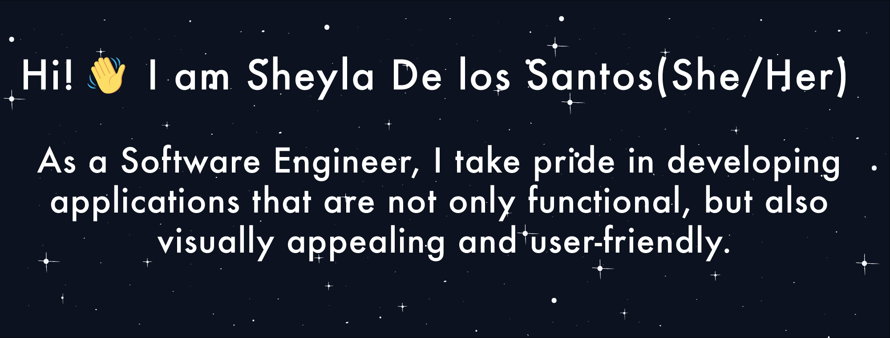

## Reach me at:

- [LinkedIn](https://www.linkedin.com/in/sheyladelossantos/) 🙃
- [Email](mailto:sheyla@sheyladelossantos.net) ✨

## 👉 Currently working on:

- A mental health support app for people in the trying to conceive journey 💫
- Practicing my Data Structures knowledge on LeetCode and AlgoExpert ⚡️

## 📚 I'm also learning:

- Python and TypeScript 👩‍💻

## Take a look at my projects!

- 👩‍💻 I built myself a portfolio [website](https://sheyladelossantos.net/), check it out!

## GitHub Stats 👇

